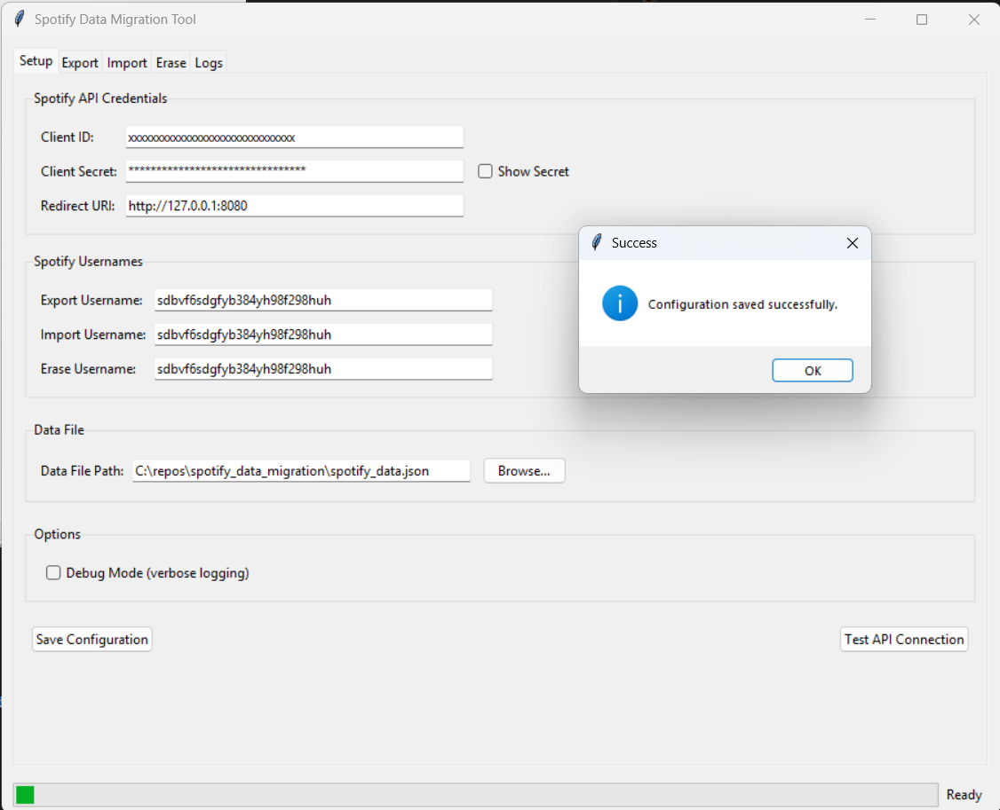

# Spotify Playlist & Liked Songs Migration Tool

This tool helps you export your Spotify playlists and liked songs to a JSON file, then import them to another Spotify account.



## Quick Start

1. **Create a Spotify Developer App**
   - Visit [Spotify Developer Dashboard](https://developer.spotify.com/dashboard/)
   - Create a new app, note your Client ID and Secret
   - Add `http://127.0.0.1:8080` as a Redirect URI

2. **IMPORTANT: Register All Users You Plan to Work With**
   - In your Spotify App dashboard, go to **Edit Settings → User Management**
   - Add **BOTH** your source and destination accounts in the format:
     ```
     username:email@example.com
     ```
   - You must add any account you want to use with this tool
   - Click **Save**

3. **Install Dependencies**
   ```
   pip install -r requirements.txt
   ```

4. **Run the Application**
   ```
   python -m src.main
   ```

## Using the Tool

### Export Data (Source Account)
1. In Setup tab, enter API credentials and source username
2. Click "Start Export" to save your playlists, liked songs, and **playlist images**

### Import Data (Destination Account)
1. Change username to destination account in Setup tab
2. Click "Start Import" to add playlists and liked songs

## New Features

### Playlist Image Export
The tool now exports playlist images and custom album covers! This includes:
- ✅ Custom uploaded playlist covers
- ✅ Auto-generated mosaic covers
- ✅ Multiple image resolutions
- ✅ Image URLs preserved in export data

Playlist images are automatically included in your export JSON file for future use.

### Automatic Cache Management
The tool automatically cleans authentication cache when switching between usernames, so you don't need to manually select "Clean Cache" anymore.

## Troubleshooting

### "User Not Registered" Error
This is the most common error and means you need to add the Spotify account to your Developer Dashboard:

1. Go to [Spotify Developer Dashboard](https://developer.spotify.com/dashboard/)
2. Open your app
3. Go to **Edit Settings → User Management**
4. Add the account with `username:email@example.com`
5. Save and try again

### Authentication Issues
- Ensure the Redirect URI exactly matches `http://127.0.0.1:8080`
- The tool now automatically clears cached tokens when username changes
- If you still have issues, manually delete any `.cache*` files in the application directory

## GUI Features

- **Setup Tab**: Configure credentials and usernames
- **Export Tab**: Save playlists and liked songs to a file
- **Import Tab**: Add saved playlists to a different account
- **Erase Tab**: Delete playlists and liked songs (use with caution)
- **Logs Tab**: View operation details and errors


