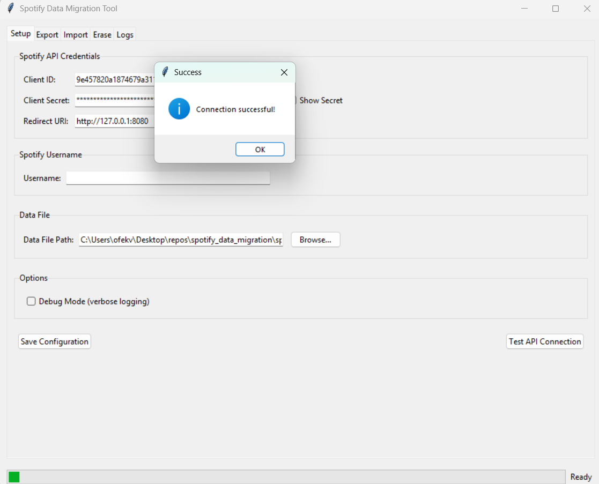

# Spotify Playlist & Liked Songs Export/Import Script



This utility exports your **Spotify playlists and liked songs** to a JSON file and later imports them to another Spotify account. It offers both a command-line interface (CLI) and a graphical user interface (GUI), designed with modularity, error handling, and batch processing in mind for large collections.

---

## Table of Contents

- [Prerequisites](#prerequisites)
- [Setup](#setup)
  - [1. Create a .env File](#1-create-a-env-file)
- [Installation Options](#installation-options)
  - [Option 1: Use Executable Installer](#option-1-use-executable-installer)
  - [Option 2: Install from Source](#option-2-install-from-source)
- [Usage](#usage)
  - [Command-Line Interface (CLI)](#command-line-interface-cli)
  - [Graphical User Interface (GUI)](#graphical-user-interface-gui)
  - [Export Data](#export-data)
  - [Import Data](#import-data)
  - [Erase Data](#erase-data)
  - [Additional CLI Options](#additional-cli-options)
  - [Selective Operations](#selective-operations)
- [GUI Mode](#gui-mode)
  - [Setup Tab](#setup-tab)
  - [Export Tab](#export-tab)
  - [Import Tab](#import-tab)
  - [Erase Tab](#erase-tab)
  - [Logs Tab](#logs-tab)
- [Project Architecture](#project-architecture)
  - [Key Components](#key-components)
- [⚠️Troubleshooting⚠️](#troubleshooting)
- [Building Executables](#building-executables)
- [Installing Dependencies](#installing-dependencies)

---

## Prerequisites

1. **Create a Spotify Developer App**
   - Visit the [Spotify Developer Dashboard](https://developer.spotify.com/dashboard/).
   - Click **Create an App**.
   - Set an app name and description.
   - Copy the **Client ID** and **Client Secret** (you will use these in the `.env` file).
   - Under **Redirect URIs**, add `http://127.0.0.1:8080`.
   - Click **Save**.
   - **IMPORTANT:** Ensure that the account you wish to use is added under **User Management** (see Troubleshooting).

2. **Install Required Python Packages**

   ```sh
   pip install -r requirements.txt
   ```

---

## Setup

### 1. Create a .env File

Create a `.env` file in the project root directory and add your Spotify API credentials.

#### Option 1: Different accounts for each operation

Use this configuration if you want to export from one account and import to another:

```env
CLIENT_ID='your_spotify_client_id'
CLIENT_SECRET='your_spotify_client_secret'
EXPORT_USERNAME='account_to_export_from'
IMPORT_USERNAME='account_to_import_to'
ERASE_USERNAME='account_to_erase_data_from'
REDIRECT_URI='http://127.0.0.1:8080'
```

#### Option 2: Same account for all operations

Use this simpler configuration if you're using the same Spotify account for all operations, or plan to manually change the account between runs.

```env
CLIENT_ID='your_spotify_client_id'
CLIENT_SECRET='your_spotify_client_secret'
SPOTIFY_USERNAME='your_spotify_username'
REDIRECT_URI='http://127.0.0.1:8080'
```

The script will use `SPOTIFY_USERNAME` as a fallback when operation-specific usernames aren't provided.

#### 🔍 Where to Get These Values?

- **CLIENT_ID** and **CLIENT_SECRET**  
  Obtain these from your [Spotify Developer Dashboard](https://developer.spotify.com/dashboard/) under your created app.

- **EXPORT_USERNAME / IMPORT_USERNAME / ERASE_USERNAME**  
  These are your Spotify account usernames. Find them on your Spotify profile or review [this guide](https://community.spotify.com/t5/FAQs/What-s-a-Spotify-username/ta-p/5286512).

- **REDIRECT_URI**  
  This URI must match the one added in your Spotify app settings (typically: `http://127.0.0.1:8080`).

---

## Installation Options

You can either download a pre-built executable for your platform or install from source.

### Option 1: Use Executable Installer

For users who prefer not to install Python or manage dependencies:

1. **Download the Installer**:
   - Go to the [Releases](https://github.com/yourusername/spotify_data_migration/releases) page
   - Download the appropriate installer for your system:
     - Windows: `SpotifyDataMigration-Setup-vX.X.X.exe` or `SpotifyDataMigration-vX.X.X.msi`
     - macOS: `SpotifyDataMigration-vX.X.X.dmg` (if available)
     - Linux: `spotify-data-migration_X.X.X_amd64.deb` or `.rpm` (if available)

2. **Run the Installer**:
   - Windows: Double-click the `.exe` or `.msi` file and follow the installation wizard
   - macOS: Open the `.dmg` file and drag the application to your Applications folder
   - Linux: Use your package manager to install the `.deb` or `.rpm` file

3. **Launch the Application**:
   - Windows: Find "Spotify Data Migration" in your Start menu
   - macOS: Open from Applications
   - Linux: Run from your applications menu or use `spotify-data-migration` in terminal

4. **First-time Setup**:
   - The application will prompt you to configure your Spotify API credentials on first launch
   - Follow the same setup steps described in the [Setup](#setup) section

### Option 2: Install from Source

If you prefer to run the Python code directly:

Ensure that all required dependencies are installed using the provided `requirements.txt`:

```sh
pip install -r requirements.txt
```

Contents of `requirements.txt`:

```
spotipy==2.23.0
python-dotenv==1.0.0
requests==2.31.0
```

---

## Usage

Execute the script using the Python module flag (`-m`) followed by the package path (`src.main`) and your chosen action flag.

### Command-Line Interface (CLI)

Use the following flags for CLI operations: `--export`, `--import-data`, `--erase`.

### Graphical User Interface (GUI)

Launch the graphical interface:

```sh
python -m src.main --gui
```

### Export Data

Fetch all playlists and liked songs from the **exporting account** (defined by `EXPORT_USERNAME` in `.env`) and save the data into `spotify_data.json` (or your specified file):

```sh
python -m src.main --export
```

### Import Data

Read the JSON file (defaults to `spotify_data.json`) and import the playlists and liked songs to the **importing account** (specified by `IMPORT_USERNAME` in `.env`):

```sh
python -m src.main --import-data
```

### Erase Data

**Warning:** This action will erase **all** playlists and liked songs from the **erasing account** (defined by `ERASE_USERNAME` in `.env`). A confirmation prompt will be displayed.

```sh
python -m src.main --erase
```

### Additional CLI Options

#### Enable Debug Mode

For detailed logging including API calls and timing, use the `--debug` flag:

```sh
python -m src.main --export --debug
```

#### Clear Cache Before Running

Using `--clean-cache` removes any cached authentication tokens before execution. This is useful when troubleshooting authentication issues or switching accounts:

```sh
python -m src.main --import-data --clean-cache
```

#### Specify Data File

You can define a custom JSON file for export/import with the `--data-file` flag:

```sh
python -m src.main --export --data-file my_backup.json
python -m src.main --import-data --data-file my_backup.json
```

#### Combined Usage Example

You may combine several options:

```sh
python -m src.main --export --debug --clean-cache --data-file custom_export.json 
```

This command:
- Clears the cached token for the `EXPORT_USERNAME`.
- Exports data to `custom_export.json`.
- Provides detailed debug logs.

### Selective Operations

You can use the `--selective` (or `-s`) flag to enable interactive selection of playlists for export, import, or deletion:

```sh
python -m src.main --export --selective
python -m src.main --import-data --selective
python -m src.main --erase --selective
```

This will present you with a list of available playlists and options to select specific ones:
- **Enter numbers separated by commas** (e.g., `1,3,5`)
- **Enter a range** (e.g., `1-5`)
- **Enter `all`** to select all playlists
- **Enter `public`** to select only public playlists
- **Enter `private`** to select only private playlists

For liked songs, you'll be prompted separately whether to include them in the operation.

Example:

```
Available Playlists:
------------------------------------------------------------
#    Playlist Name                          Track Count Public
------------------------------------------------------------
1    Workout Mix                            45         Yes
2    Chill Vibes                            120        No
3    Party Playlist                         85         Yes
...

Selection options:
- Enter numbers separated by commas (e.g., '1,3,5')
- Enter a range (e.g., '1-5')
- Enter 'all' to select all playlists
- Enter 'public' to select only public playlists
- Enter 'private' to select only private playlists
- Enter 'q' or press Ctrl+C to cancel

Select playlists: 1,3
```

---

## GUI Mode

Launch the GUI using the `--gui` flag. The GUI provides a user-friendly way to manage the export, import, and erase operations.

```sh
python -m src.main --gui
```

The GUI is organized into several tabs:

### Setup Tab

- Configure your Spotify API **Client ID**, **Client Secret**, and **Redirect URI**.
- Specify the **Usernames** for export, import, and erase operations.
- Set the **Data File** path for saving/loading data (defaults to `spotify_data.json`).
- Enable **Debug Mode** for verbose logging.
- **Save Configuration:** Saves the current settings to the `.env` file.
- **Test API Connection:** Authenticates with Spotify using the provided credentials and export username to verify the setup.

### Export Tab

- **Selective Export:** Check this to choose specific playlists to export. If unchecked, all playlists and liked songs (unless deselected in the prompt) will be exported.
- **Clean Cache Before Export:** Clears the authentication cache before starting the export.
- **Start Export:** Initiates the export process based on the settings in the Setup tab.

### Import Tab

- **Selective Import:** Check this to choose specific playlists from the data file to import. If unchecked, all playlists and liked songs (unless deselected in the prompt) from the file will be imported.
- **Clean Cache Before Import:** Clears the authentication cache before starting the import.
- **Start Import:** Initiates the import process using the data file specified in the Setup tab.

### Erase Tab

- **⚠️ WARNING:** Use this tab with extreme caution!
- **Selective Erase:** Check this (recommended) to choose specific playlists to delete. You will also be prompted about deleting liked songs. If unchecked, **all** playlists and liked songs will be deleted after multiple confirmations.
- **Clean Cache Before Erase:** Clears the authentication cache before starting the erase operation.
- **Start Erase:** Initiates the deletion process on the account specified in the Setup tab.

### Logs Tab

- Displays real-time logs from the application.
- Log messages are color-coded by severity (Error, Warning, Info, Debug).
- **Clear Logs:** Clears the log display area.
- **Save Logs:** Saves the current log content to a file.

---

## Project Architecture

The project is organized for modularity and ease of maintenance:

```
spotify_data_migration/
├── src/
│   ├── __init__.py
│   ├── config.py         # Loads configuration & environment variables
│   ├── spotify_manager.py # Core interactions with the Spotify API, including:
│   │                     #  - Authentication
│   │                     #  - Playlist and track operations (with automatic pagination)
│   │                     #  - Rate limiting and error handling
│   ├── data_handler.py   # JSON operations for export/import
│   ├── logger.py         # Logging configuration and setup
│   ├── gui.py           # Graphical User Interface (Tkinter)
│   └── main.py           # CLI and main execution logic
├── .env                  # Environment variable configuration
├── requirements.txt      # Project dependencies
└── README.md             # Documentation (this file)
```

### Key Components

- **SpotifyManager:**  
  Contains methods for authenticating, fetching playlists & liked songs, handling paginated API responses, and managing rate limits (e.g., automatic retries with exponential backoff).

- **Data Handler:**  
  Provides robust functions to export data to a JSON file and import data from it, ensuring data integrity and proper error handling during file operations.

- **Logger:**  
  Configured for console output and integration with the GUI log viewer.

- **CLI (main.py):**  
  Parses command-line arguments and orchestrates the overall export/import/erase operations, with user confirmations for critical operations.

- **GUI (gui.py):**  
  Provides a graphical user interface built with Tkinter for easier interaction, including configuration management, operation execution, and log viewing.

---

## ⚠️Troubleshooting⚠️

### **403 Forbidden Error**

- Verify that your Spotify Developer app has the correct **Redirect URI** (`http://127.0.0.1:8080`).
- Ensure the target Spotify account is registered as a user in your Spotify app settings.
- Remove cached tokens by deleting any `.cache*` files:

  ```sh
  rm -rf .cache*
  ```

### **User Not Registered Error**

If you see the error message below:

```
Check settings on developer.spotify.com/dashboard, the user may not be registered., reason: None
```

Complete these steps to register the user:

1. Visit the [Spotify Developer Dashboard](https://developer.spotify.com/dashboard/).
2. Open your Spotify App.
3. Go to **Edit Settings** → **User Management**.
4. Add the user in the `username:email` format, for example:

   ```
   myspotifyusername:myemail@example.com
   ```

5. Click **Save** and try running the script again.

For further details, refer to the [Spotify Web API Documentation](https://developer.spotify.com/documentation/web-api/).

---

## Building Executables

Project maintainers can build executable installers for distribution:

### Windows Executable with PyInstaller

1. Install PyInstaller and UPX (optional, for better compression):
   ```sh
   pip install pyinstaller
   # Optional: Download UPX from https://github.com/upx/upx/releases and add to PATH
   ```

2. Build the executable with proper metadata:
   ```sh
   pyinstaller --name "SpotifyDataMigration" --windowed --icon=assets/spotify_icon.ico ^
               --add-data "assets/*;assets/" --clean ^
               --noupx ^
               --version-file=version_info.txt ^
               spotify_migrator.py
   ```

3. Create a `version_info.txt` file first:
   ```
   # UTF-8
   #
   # For more details about fixed file info 'ffi' see:
   # http://msdn.microsoft.com/en-us/library/ms646997.aspx
   VSVersionInfo(
     ffi=FixedFileInfo(
       # filevers and prodvers should be always a tuple with four items: (1, 2, 3, 4)
       # Set not needed items to zero 0.
       filevers=(1, 0, 0, 0),
       prodvers=(1, 0, 0, 0),
       # Contains a bitmask that specifies the valid bits 'flags'r
       mask=0x3f,
       # Contains a bitmask that specifies the Boolean attributes of the file.
       flags=0x0,
       # The operating system for which this file was designed.
       # 0x4 - NT and there is no need to change it.
       OS=0x40004,
       # The general type of file.
       # 0x1 - the file is an application.
       fileType=0x1,
       # The function of the file.
       # 0x0 - the function is not defined for this fileType
       subtype=0x0,
       # Creation date and time stamp.
       date=(0, 0)
     ),
     kids=[
       StringFileInfo(
         [
         StringTable(
           u'040904B0',
           [StringStruct(u'CompanyName', u'YourName'),
           StringStruct(u'FileDescription', u'Spotify Data Migration Tool'),
           StringStruct(u'FileVersion', u'1.0.0'),
           StringStruct(u'InternalName', u'spotify_data_migration'),
           StringStruct(u'LegalCopyright', u'© 2023-2024 YourName. All rights reserved.'),
           StringStruct(u'OriginalFilename', u'SpotifyDataMigration.exe'),
           StringStruct(u'ProductName', u'Spotify Data Migration'),
           StringStruct(u'ProductVersion', u'1.0.0')])
         ]), 
       VarFileInfo([VarStruct(u'Translation', [1033, 1200])])
     ]
   )
   ```

### Reducing Antivirus False Positives

To prevent your executable from being flagged as a virus:

1. **Sign your code** (ideal solution):
   - Purchase a code signing certificate from a trusted provider
   - Sign your executable using tools like `signtool.exe` (Windows)

2. **If you can't sign your code**:
   - Use the `--noupx` flag in PyInstaller to avoid compression that triggers some AV
   - Add proper version metadata as shown above
   - Submit your installer to Microsoft for analysis at the [Windows Defender portal](https://www.microsoft.com/en-us/wdsi/filesubmission)
   - Create an installer with Inno Setup as this has better reputation
   - Consider disabling the console with `--windowed`
   - Add detailed instructions for users who encounter AV warnings

### Windows Installer with Inno Setup

1. Download and install [Inno Setup](https://jrsoftware.org/isinfo.php)
2. Use the script in `installer/windows_installer.iss` to build the installer
3. Run Inno Setup and compile the script

### macOS App Bundle

1. Use PyInstaller with macOS options:
   ```sh
   pyinstaller --name "SpotifyDataMigration" --windowed --icon=assets/spotify_icon.icns --add-data "assets/*:assets/" src/main.py
   ```

2. Create a DMG file using [create-dmg](https://github.com/create-dmg/create-dmg) or similar tool

### Publishing Releases on GitHub

1. Create a new release on GitHub
2. Upload the built installers and executables
3. Add release notes describing changes
4. Publish the release

---

## Installing Dependencies

Ensure that all required dependencies are installed using the provided `requirements.txt`:

```sh
pip install -r requirements.txt
```

Contents of `requirements.txt`:

```
spotipy==2.23.0
python-dotenv==1.0.0
requests==2.31.0
```

---

Feel free to contribute improvements or report issues by opening an issue in the project repository. Enjoy backing up and migrating your Spotify data with confidence!


